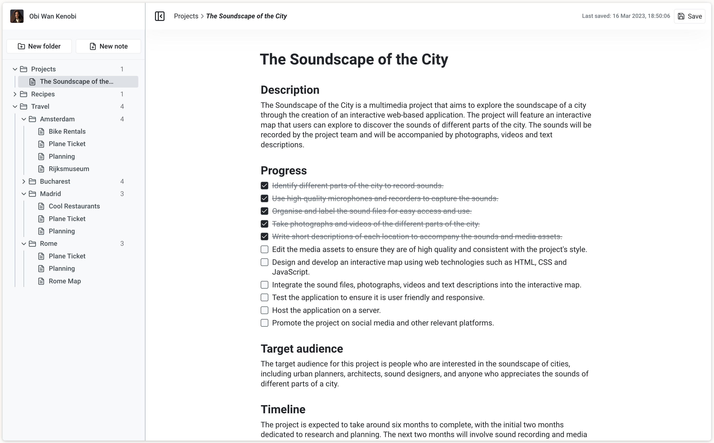

# VNotes-Server

VNotes is a very small scale note taking app inspired by Notion. I have developed it for my university's Final Degree Project.

This repo corresponds to the REST API of the app. You can find the frontend [here](https://github.com/JustDMare/VNotes).



## Project Setup

### Prerequisites

#### Node

[https://nodejs.org/en](https://nodejs.org/en)

It requires, at least Node 16 to be installed into your system. Since Node 16 is almost at the end of its lifetime, it has also been tested to work with Node 18.

#### Auth0

[https://auth0.com/](https://auth0.com/)

This project uses Auth0 for authentication. And it requires it to setup an API and Application (SPA).

This project uses Auth0 for authentication. And it requires it to setup an Auth0 **API** and an  **Application** (SPA).

For the Application, make sure to:

* Add the following URLs to the **Allowed Callback URLs**: `http://localhost:3000, http://localhost:3000/workspace`
* Add the following URL to the **Allowed Logout URLs**: `http://localhost:3000`
* Add the following URL to the **Allowed Web Origins**: `http://localhost:3000, http://localhost:3000/workspace, http:localhost`
* Allow **Cross-Origin Authentication**.
* Add the following URL to the **Allowed Origins (CORS)**: `http://localhost:3000, http://localhost:3000/workspace, http:localhost`

The remaining settings should be fine if left in their default values.

In the case of the API, leaving the default settings should be enough.

Then, with the information from the Auth0 Application and API, you'll need an .env file at root level with the following contents:

`AUTH0_AUDIENCE` -> The **Audience** of the API
`AUTH0_ISSUER_BASE_URL` -> The domain of the tenant

#### MongoDB

You will need to setup an Atlas Cluster Database. There are no specific requirements for it, the only thing you'll need is to add the following fields to the .env file:

`MONGO_USERNAME` -> Username of a Cluster User (preferably admin).
`MONGO_PASSWORD` -> Password of the Cluster User.
`MONGO_DB` -> Name of the DB you want the API to create on the Cluster.

`SERVER_PORT="3030"` -> Not a requirement for Mongo, but it is needed to choose the port at which the API will be launched. Just make sure that it is NOT port 3000, as it is needed by the frontend.

### Running the application

To install the dependencies:

```sh
npm install
```

After the installation is complete, you only have to execute the following command to run the project:

```sh
npm run dev
```

If you need to restart the server, because of an error or for some other reason, simply introduce the command `rs`.
